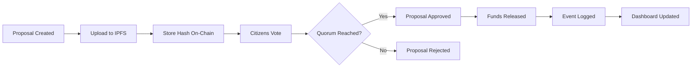

# 🏛️ TaxTrack - Transparent Government Audits

[](https://opensource.org/licenses/MIT)
[](https://soliditylang.org/)
[](https://nextjs.org/)
[](https://hardhat.org/)

## 📘 Overview

**TaxTrack** is a decentralized civic-tech application built on Ethereum and Polygon testnets that provides an immutable, transparent public audit system for tax collections and government expenditure tracking. It empowers citizens through DAO-based voting and transparent IPFS-backed documentation.

⚠️ **TESTNET ONLY** - No real money involved. This is an educational and proof-of-concept project.

## ✨ Key Features

- 🗳️ **DAO-Based Governance** - Citizens vote on budget proposals and expenditures
- 📊 **Transparent Auditing** - All transactions recorded on-chain
- 📁 **IPFS Documentation** - Immutable storage for proposals and receipts
- 🔐 **Trustless Architecture** - No central authority required
- 🎫 **ERC-20 Voting Tokens** - Weighted voting rights for citizens
- 📈 **Real-time Dashboard** - Live monitoring of government funds and proposals
- 🔔 **Event Logging** - Complete audit trail of all actions

## 🛠️ Tech Stack

| Layer | Technology |
|-------|-----------|
| **Blockchain** | Ethereum (Sepolia) + Polygon (Mumbai) Testnets |
| **Smart Contracts** | Solidity 0.8.20 + Hardhat + OpenZeppelin |
| **Token Standard** | ERC-20 (for DAO voting rights) |
| **Frontend** | Next.js 14 + React + Tailwind CSS |
| **UI Components** | 21st.dev, ReactBits, Magic UI |
| **Storage** | IPFS (Web3.Storage) |
| **Backend** | Node.js + Express + SQLite (optional caching) |
| **Web3 Library** | Ethers.js v6 + Wagmi |
| **Testing** | Hardhat + Chai + Jest |
| **Monitoring** | Tenderly + Etherscan APIs + Sentry |

## 📁 Project Structure

```
taxtrack-dapp/
├── contracts/          # Solidity smart contracts
├── frontend/          # Next.js frontend application
├── backend/           # Optional API server for caching
├── scripts/           # Deployment and utility scripts
├── test/             # Smart contract tests
├── docs/             # Comprehensive documentation
│   ├── architecture/ # System architecture docs
│   ├── requirements/ # Functional & non-functional requirements
│   ├── diagrams/     # UML, DFD, and system diagrams
│   ├── testing/      # QA and testing documentation
│   ├── deployment/   # Deployment guides
│   └── governance/   # DAO governance documentation
└── monitoring/       # Monitoring and logging configs
```

## 🚀 Quick Start

### Prerequisites

- Node.js >= 18.0.0
- npm or yarn
- MetaMask or compatible Web3 wallet
- Alchemy or Infura API key

### Installation

```bash
# Clone the repository
git clone https://github.com/yourusername/taxtrack-dapp.git
cd taxtrack-dapp

# Install dependencies
npm install

# Setup environment variables
cp .env.example .env
# Edit .env with your configuration

# Compile smart contracts
npm run compile

# Run tests
npm run test

# Deploy to testnet
npm run deploy:sepolia

# Start frontend
cd frontend
npm run dev
```

## 📖 Documentation

Comprehensive documentation is available in the `/docs` directory:

- [Project Formulation](./docs/01-project-formulation.md)
- [Functional Requirements](./docs/requirements/02-functional-requirements.md)
- [Non-Functional Requirements](./docs/requirements/03-non-functional-requirements.md)
- [System Architecture](./docs/architecture/04-high-level-architecture.md)
- [Product Requirements Document](./docs/12-product-requirements.md)
- [Testing Plan](./docs/testing/15-qa-testing-plan.md)
- [Deployment Guide](./docs/deployment/16-deployment-ci-cd.md)

## 👥 User Roles

1. **Citizens** - Vote on proposals, view audits, submit concerns
2. **Government Admins** - Create funding proposals, upload documentation
3. **Auditors** - Review proposals, verify expenditures, flag issues
4. **DAO Token Holders** - Participate in governance decisions

## 🔄 Workflow



## 🧪 Testing

```bash
# Run all tests
npm run test

# Run tests with coverage
npm run test:coverage

# Run gas reporter
npm run test:gas

# Run specific test file
npm run test test/DAOContract.test.js
```

## 🌐 Deployment

The project supports deployment to multiple testnets:

```bash
# Deploy to Sepolia
npm run deploy:sepolia

# Deploy to Polygon Mumbai
npm run deploy:mumbai

# Verify contracts
npm run verify:sepolia
```

## 🔒 Security

- ✅ No real funds - testnet only
- ✅ Input sanitization on all user inputs
- ✅ Reentrancy guards on contract functions
- ✅ Access control with OpenZeppelin
- ✅ Rate limiting on proposal creation
- ✅ Multi-signature requirements for critical actions

## 📊 Monitoring & Analytics

- **Tenderly** - Real-time contract monitoring
- **Etherscan APIs** - Transaction tracking
- **Sentry** - Frontend error tracking
- **Custom Dashboard** - Proposal metrics and voting statistics

## 🤝 Contributing

Contributions are welcome! Please read our [Contributing Guidelines](./CONTRIBUTING.md) before submitting PRs.

## 📄 License

This project is licensed under the MIT License - see the [LICENSE](./LICENSE) file for details.

## 🙏 Acknowledgments

- OpenZeppelin for secure contract libraries
- Hardhat for development framework
- IPFS for decentralized storage
- The Ethereum and Polygon communities

## 📞 Contact

- **Project Lead**: [Your Name]
- **Email**: contact@taxtrack.example
- **Twitter**: [@TaxTrackDAO](https://twitter.com/taxtrackdao)
- **Discord**: [Join our community](https://discord.gg/taxtrack)

---

Built with ❤️ for transparent governance
